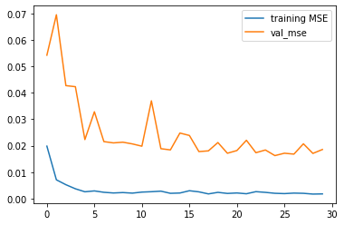
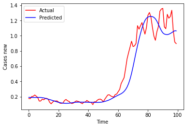

# Covid_case_prediction
 Creating deep learning model using LSTM to predict new covid cases in Malaysia
 
# Background

# Description

# How to Run the Project
1. Clone the repository
2. Open the directory
3. Locate the `Train.py` inside the previous directory of the cloned repository
4. Run the file on your chosen IDEs
5. If done correctly, this will generate the results

## Neural Network Model Plot

## Model Performance on The Test Dataset
## Model Training/Test MSE plot

## Model Training/Test MAPE plot

## Model Prediction
## Model Training/Test MSE plot

## Tensorboard plot

## Mean Absolute Percentage Error value

# Credits
- [Markdown badges source](https://github.com/Ileriayo/markdown-badges)
- [Dataset source]([https://www.kaggle.com/datasets/kunalgupta2616/hackerearth-customer-segmentation-hackatho](https://github.com/MoH-Malaysia/covid19-public)
